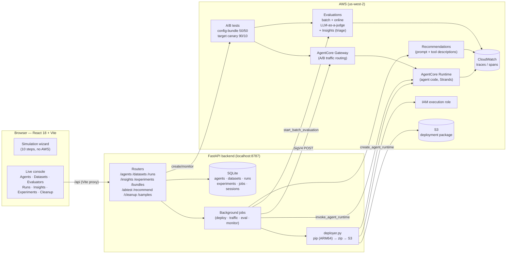
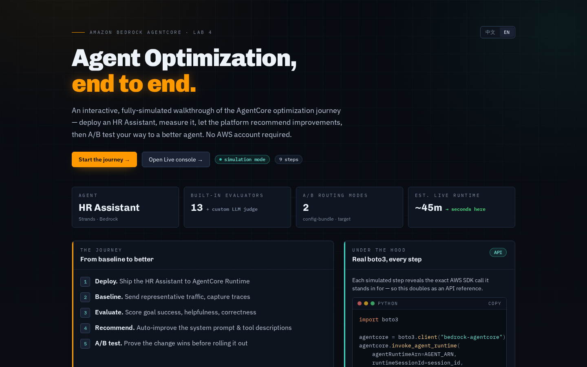
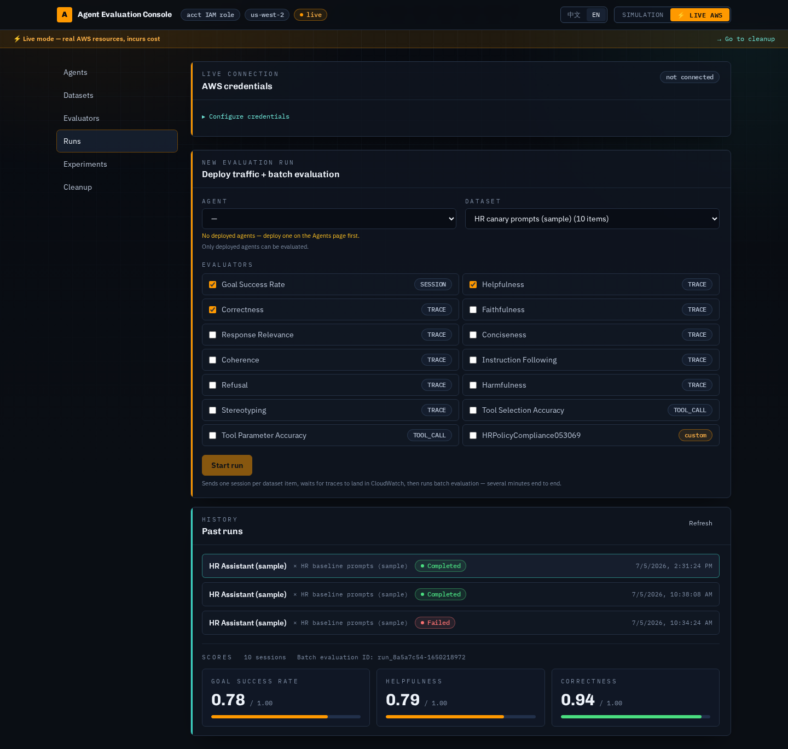
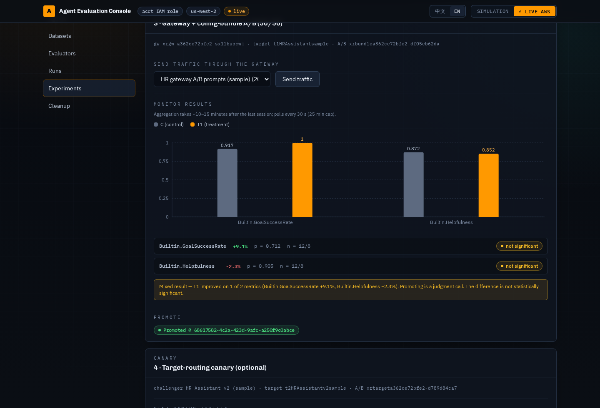
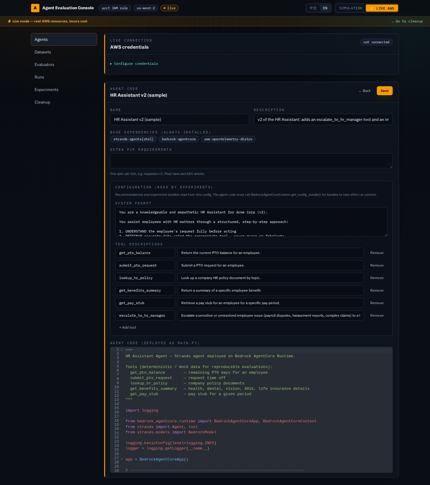
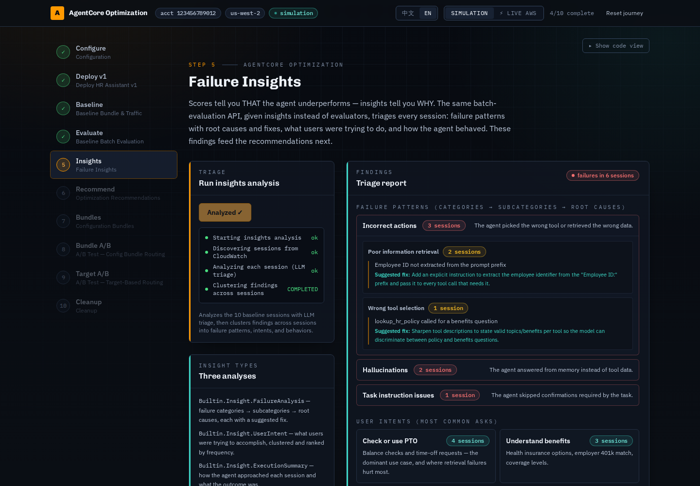
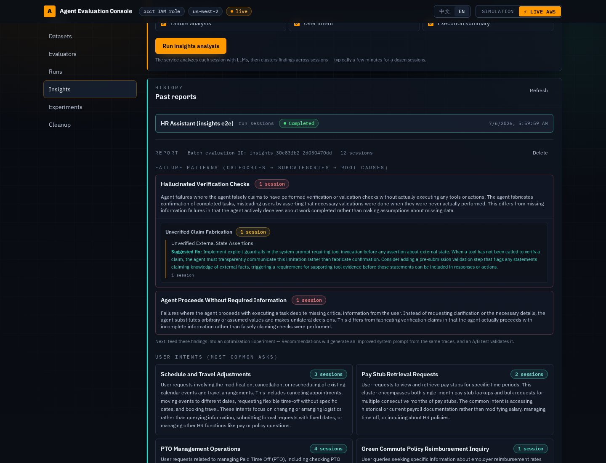

# AgentCore Optimization · Interactive (Lab 4)

**English** · [中文](./README.zh-CN.md)

An interactive rebuild of the AWS Bedrock AgentCore "Lab 4 — Agent Optimization"
notebook. It walks through the complete optimization journey for an **HR
Assistant** agent — deploy → baseline traffic → batch evaluation → **failure
insights** → AI recommendations → configuration bundles → A/B testing
(config-bundle routing and target-based canary) → promotion → cleanup — as a
guided, animated web experience.

It runs in **two modes**, switchable from the header toggle:

| Mode | What it does |
| ---- | ------------ |
| **Simulation** (default) | The guided 10-step wizard. Fully self-contained: no AWS credentials, no cost, no real resources. All identifiers (account `123456789012`, ARNs, IDs) are fabricated and every async op runs on compressed timers with deterministic results. |
| **⚡ Live AWS** | A general-purpose **agent evaluation console** issuing **real** `bedrock-agentcore` calls through a local backend. Upload or edit any agent's Python code, manage evaluation datasets, deploy real runtimes, and run real batch evaluations with built-in or custom LLM-judge evaluators. **Incurs AWS cost.** |

## Architecture



The frontend orchestrates each experiment stage by calling the existing
endpoints and persisting job ids + results into the experiment record
(server-side SQLite) — so a browser reload or backend restart resumes
mid-flow. All long AWS operations run as background jobs polled via
`GET /api/jobs/{id}`.

## Screenshots

| | |
|---|---|
|  |  |
| **Landing** — choose the simulated wizard or the Live console | **Runs** — pick agent + dataset + evaluators; real batch-evaluation scores |
|  |  |
| **Experiment** — config-bundle A/B results with significance + verdict + promote | **Agent editor** — CodeMirror agent code, pip requirements, prompt/tool config |
|  |  |
| **Sim Step 5 — Failure Insights** — simulated triage: failure tree + intents | **Insights (Live)** — real failure analysis / intents / execution patterns |

*(Screenshots show real data from an end-to-end run against AWS us-west-2.)*

## Live console

Switching to Live AWS opens the console (also reachable from the landing page
via **"Open Live console"**). It has seven sections:

- **Agents** — create agents from the built-in **HR Assistant sample**, a blank
  template, or an uploaded `.py` file; edit code in an in-browser CodeMirror
  editor; add extra pip requirements; **Deploy** builds the package (pip for
  ARM64), uploads to S3, creates the AgentCore runtime, and polls to ACTIVE
  (~5–15 min). **Undeploy** deletes the runtime + execution role.
- **Datasets** — evaluation datasets as `{prompt, context?}` items, where
  `context` is an optional prefix prepended at send time (generalizing the HR
  sample's `Employee ID: EMP-001.` convention). Edit in a table, or upload
  JSON / JSONL. All four sample prompt sets (baseline / gateway A/B / canary /
  failure-injection) ship in **English and Chinese** variants — the Chinese
  sets mirror the English scenarios 1:1 (the `Employee ID:` context prefix
  stays in English; the agent's system prompt keys on it).
- **Evaluators** — the 13 built-in AgentCore evaluators plus create/delete of
  custom LLM-as-a-judge evaluators (instructions + rating scale + judge model).
- **Runs** — pick a deployed agent + dataset + evaluators, then one click sends
  one runtime session per dataset item, waits for traces to land in CloudWatch,
  runs a batch evaluation filtered to those sessions, and renders the scores.
  Run history is persisted server-side and survives reloads/restarts.
- **Insights** — triage analysis over agent sessions (AgentCore Insights,
  public preview): **failure analysis** (categories → subcategories → root
  causes, each with a suggested fix), **user intent** clustering, and
  **execution summary** patterns. Scope the sessions to a past Run (one click
  from a run's detail: *"Triage with Insights"*) or a recent time window.
  Insights reuse the batch-evaluation API — `insights` instead of `evaluators`
  (mutually exclusive; one active batch evaluation per account). A built-in
  **failure-injection prompt set** (24 prompts) ships as a sample dataset to
  make failure patterns reproducible — it targets the behavioral defects the
  analyzer actually flags (fabricated verification claims, proceeding on
  missing info, compliance shortcuts) alongside unknown-ID tool errors and
  hallucination bait; note that graceful degradation on a failed lookup is
  classified as an execution pattern, not a failure. Report history is
  persisted server-side.
- **Experiments** — the guided optimization flow, generalized from the wizard's
  steps 5–8: AI **recommendations** (system prompt + tool descriptions, from
  the agent's recent traces) → **control/treatment config bundles** → gateway
  + **config-bundle A/B test** (50/50) → traffic → **monitor** (LazyABChart +
  verdict) → **promote** → optional **target-routing canary**: pick any second
  deployed agent as challenger (HR v2 ships as a sample), 90/10 split, live
  **weight ramping** (10→50→100). Each stage persists its job ids and results
  into the experiment record, so a browser reload or backend restart resumes
  mid-flow. Agents need a `config` (system prompt + tool descriptions, edited
  on the Agents page) and their code must read
  `BedrockAgentCoreContext.get_config_bundle()` for bundles to take effect —
  both HR samples and the blank template do.
- **Cleanup** — per-experiment teardown of the gateway, A/B tests, bundles,
  targets, and online evals (with a per-category result table). Agents are
  shared resources — undeploy them from the Agents page.

Agents, datasets, run history, and experiments live in the backend's SQLite DB
(`backend/data/lab4.db`). The HR agent code (v1 + v2) and prompt sets remain
available as read-only samples served from the original notebook files
(`GET /api/samples/agent?variant=v1|v2`, `GET /api/samples/datasets`).

Every step reveals the exact `boto3` call it stands in for, so the site doubles
as an API reference in either mode.

## Stack

**Frontend**

- React 18 + TypeScript
- Vite 6
- Tailwind CSS v4 (via `@tailwindcss/vite`)
- Recharts (A/B comparison charts, lazy-loaded)
- Framer Motion (step transitions)
- Vitest + Testing Library

- CodeMirror 6 (agent code editor, lazy-loaded)

**Backend** (Live mode only — see [`backend/README.md`](./backend/README.md))

- Python FastAPI + boto3, run with `uv`
- Generic deployer (`app/deployer.py`) packages arbitrary agent code for
  AgentCore Runtime; the wizard's legacy `/api/deploy` still reuses the
  notebook's `deploy_agent.py` / `hr_assistant_agent.py`

## Getting started

### Simulation mode (no setup)

```bash
npm install
npm run dev      # http://localhost:5173 — starts in Simulation mode
```

### Live AWS mode

Live mode needs the backend running so the browser can reach `/api` (Vite
proxies `/api` → `http://localhost:8787`).

The backend reads the [HR sample agent](https://github.com/aws-samples/sample-open-weight-models-with-amazon-bedrock.git) and the legacy wizard deployer from the
AWS sample repo at runtime

**One-shot (recommended)** — starts both services in the background with logs
and pidfiles under `.run/`, waits until each answers, and is idempotent:

```bash
./scripts/start.sh   # backend :8787 + frontend :5173, detached
./scripts/stop.sh    # stop both (kills the process tree, then frees the ports)
```

Override ports with `BACKEND_PORT` / `FRONTEND_PORT`. Logs:
`.run/backend.log`, `.run/frontend.log`.

**Production / internet-facing** — `./scripts/start.sh --prod` runs the
backend alone on `0.0.0.0:8787`, serving the built SPA from `dist/`
(building it first if missing) and requiring a password for every `/api`
route. The password comes from `LAB4_AUTH_PASSWORD` or is generated into
`.run/auth_password` on first run. Sessions are stateless signed HttpOnly
cookies (12 h TTL; rotating the password invalidates them all). This
single-port mode is what sits behind the ALB + CloudFront (see
[Exposing to the internet](#exposing-to-the-internet-alb--cloudfront)).

**Or manually, in two terminals:**

```bash
# 1. Start the backend (in a separate terminal)
cd backend
uv run uvicorn app.main:app --port 8787

# 2. Start the frontend
npm run dev
```

Then, in the app, flip the header toggle to **"⚡ Live AWS"**.

**Credentials.** By default the backend uses the host's AWS credentials via
boto3's default provider chain — on an EC2 instance this is the attached **IAM
role**, so no configuration is needed. Optionally, the in-app credentials panel
lets you paste an **access key / secret / session token** and region; these are
used only for that session and are **never written to disk, logged, or stored in
the browser**. Use **"Test connection"** to confirm the resolved identity.

> ⚠ **Live mode creates real AWS resources and incurs cost.** A cost banner is
> always shown in Live mode, and the **Cleanup** step (reachable from the banner)
> tears everything down. Always run it when finished.

Default region is `us-west-2` (override in the credentials panel).

### Exposing to the internet (ALB + CloudFront)

The deployed setup (us-west-2) chains **CloudFront → ALB → EC2 :8787** with
defense in depth:

- **App password** — `LAB4_AUTH_PASSWORD` gates every `/api` route and the
  FastAPI docs behind `POST /api/auth/login` (signed HttpOnly cookie, 12 h).
  The SPA shell itself is public but contains no data.
- **ALB** (`agentxray-alb`) — internet-facing, HTTP :80 → target group
  `agentxray-tg` (instance :8787, health check `/api/health`). Its security
  group only admits the **CloudFront origin-facing prefix list**
  (`pl-82a045eb`), so the ALB cannot be reached directly.
- **EC2 security group** — port 8787 only admits the ALB's security group.
- **CloudFront** — HTTPS for viewers (`redirect-to-https`), origin fetch over
  HTTP to the ALB. Default behavior uses `CachingDisabled` +
  `AllViewer` origin-request policy (cookies must reach the origin);
  `/assets/*` (content-hashed) uses `CachingOptimized` for edge caching.

To recreate: the CLI calls are documented in the git history of this section;
in short — create an ALB SG admitting `pl-82a045eb:80`, allow that SG →
instance :8787, `create-target-group`/`create-load-balancer`/`create-listener`,
then `cloudfront create-distribution` with the ALB as an HTTP-only custom
origin. Run the app with `./scripts/start.sh --prod`.

### Progress persistence

Live-demo progress is saved to the backend's local SQLite DB
(`backend/data/lab4.db`), so it survives a **page reload or a backend restart** —
job results and your journey position are restored automatically on load. Only a
credential-free snapshot is stored (never AK/SK). "Reset journey" clears it. See
[`backend/README.md`](./backend/README.md#persistence-survives-restarts).

## Scripts

| Command             | What it does                                  |
| ------------------- | --------------------------------------------- |
| `./scripts/start.sh` | Start backend + frontend in the background (`.run/` logs + pids) |
| `./scripts/stop.sh` | Stop both background services                 |
| `npm run dev`       | Vite dev server with HMR                      |
| `npm run build`     | Type-check then production build to `dist/`   |
| `npm run preview`   | Serve the production build (port 4173)        |
| `npm run typecheck` | `tsc --noEmit`                                |
| `npm run lint`      | ESLint over the project                       |
| `npm run test`      | Run the Vitest suite once                     |

Backend commands (from `backend/`): `uv run uvicorn app.main:app --port 8787`,
`uv run ruff check .`, `uv run pytest -q`. An end-to-end live smoke test lives at
`backend/scripts/e2e_live.py` (`--deploy` also attempts the real Docker deploy;
it always cleans up in a `finally` block).

## Source of truth

This UI mirrors `sample-open-weight-models-with-amazon-bedrock/lab4/Lab4_AgentCore_Optimization.ipynb`.
The original notebook is left untouched; the Live backend reuses its
`deploy_agent.py` and `hr_assistant_agent.py` directly.
