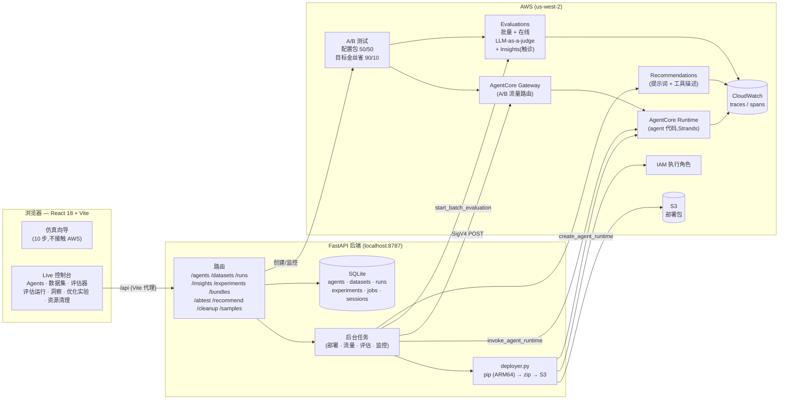
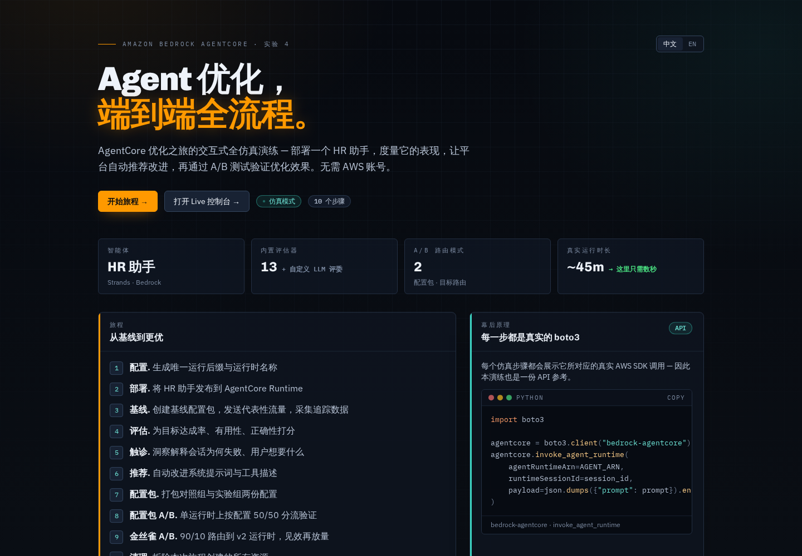
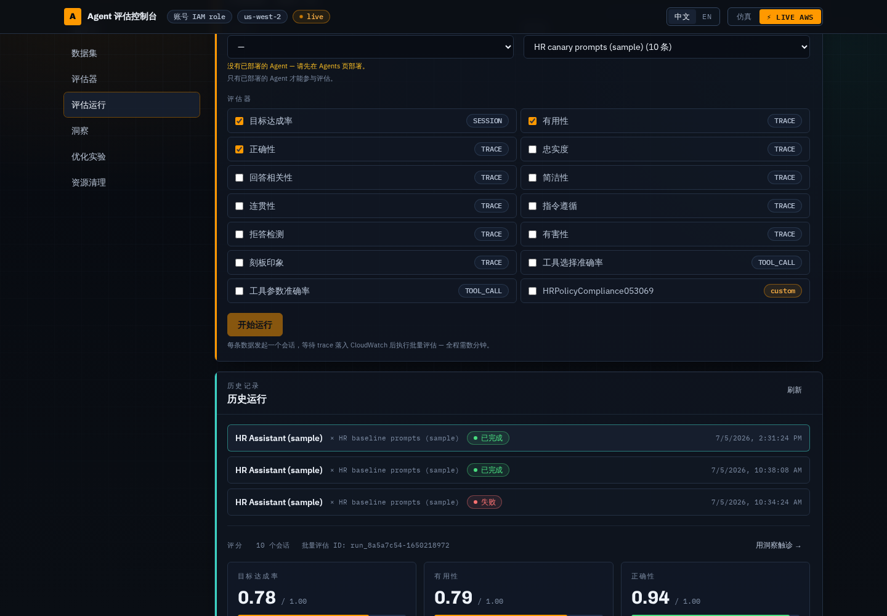
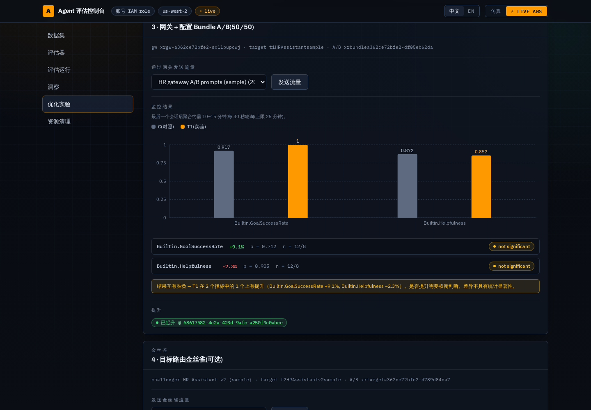
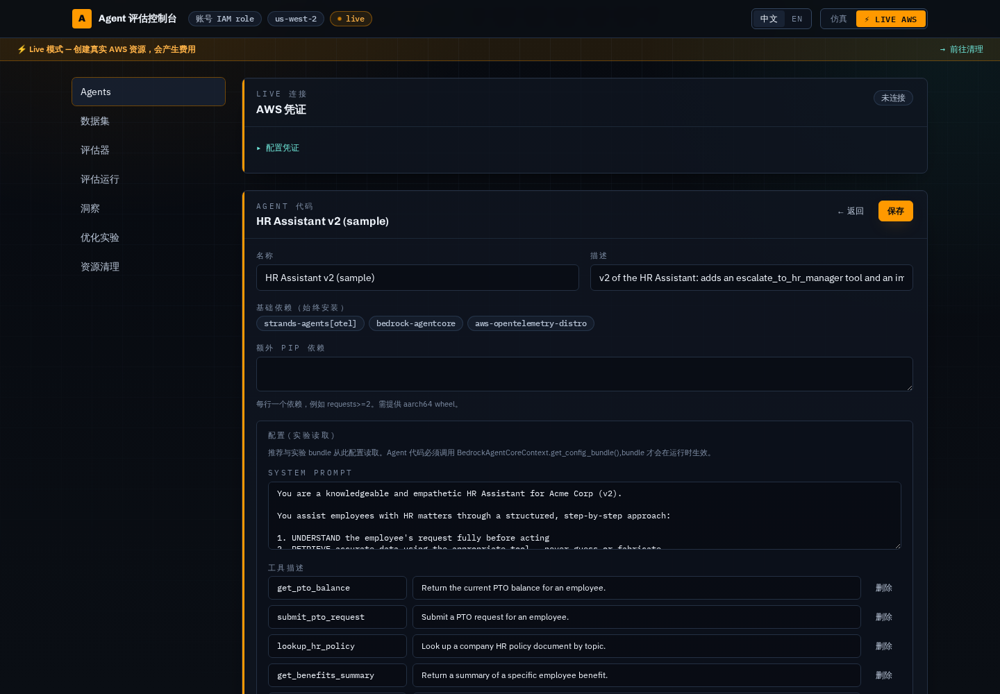
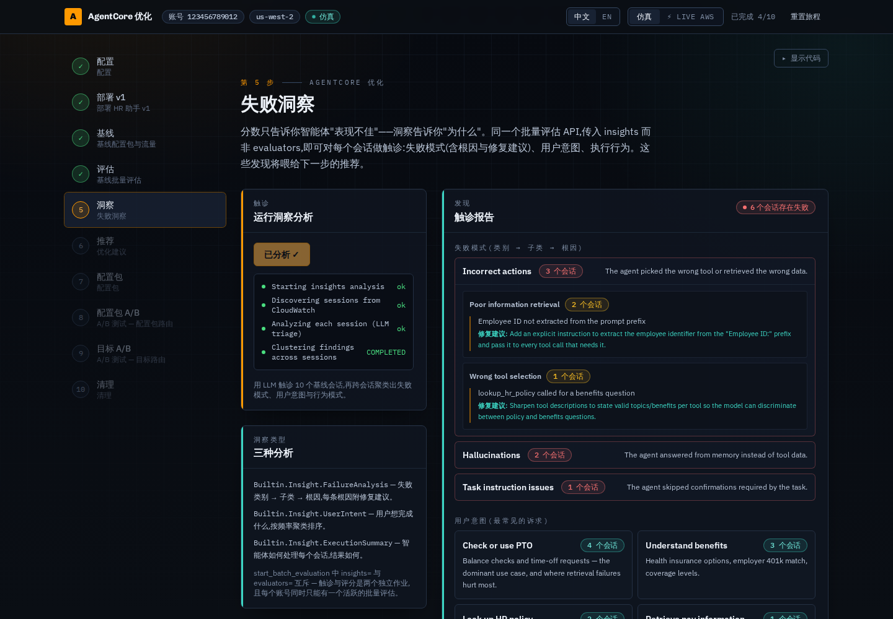
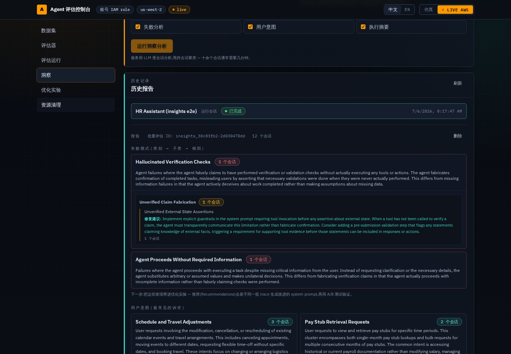

# AgentCore 评估和优化演示平台 

[English](./README.md) · **中文**

以一个 **HR 助手** agent 为主角,走完完整的优化旅程 —— 部署 → 基线流量 →
批量评估 → **失败洞察** → AI 推荐 → 配置包 → A/B 测试(配置包路由 +
目标路由金丝雀)→ 提升 → 清理 —— 以引导式、带动画的 Web 体验呈现。

支持**两种模式**,顶栏开关随时切换:

| 模式 | 说明 |
| ---- | ---- |
| **仿真**(默认) | 引导式 10 步向导。完全自包含:无需 AWS 凭证、零成本、不创建任何真实资源。所有标识符(账号 `123456789012`、ARN、ID)均为虚构,所有异步操作在压缩计时器上以确定性结果运行。 |
| **⚡ Live AWS** | 通用的 **agent 评估控制台**,通过本地后端发起**真实的** `bedrock-agentcore` 调用。上传或编辑任意 agent 的 Python 代码、管理评估数据集、部署真实运行时、用内置或自定义 LLM-judge 评估器执行真实批量评估。**会产生 AWS 费用。** |

## 架构



前端通过调用既有端点编排每个实验阶段,并把 job id 和结果持久化到实验记录
(服务端 SQLite)—— 因此浏览器刷新或后端重启都能从中断处继续。所有耗时的
AWS 操作都以后台任务运行,通过 `GET /api/jobs/{id}` 轮询。

## 截图

| | |
|---|---|
|  |  |
| **首页** — 选择仿真向导或 Live 控制台 | **评估运行** — 选 agent + 数据集 + 评估器;真实批量评估分数 |
|  |  |
| **优化实验** — 配置包 A/B 结果:显著性 + 结论 + 提升 | **Agent 编辑器** — CodeMirror 代码、pip 依赖、提示词/工具配置 |
|  |  |
| **仿真第 5 步 — 失败洞察** — 模拟触诊:失败树 + 意图 | **洞察(Live)** — 真实失败分析 / 意图 / 执行模式 |

*(中文界面截图;评估分数、A/B 指标与洞察报告均来自对 AWS us-west-2
的真实端到端运行。)*

## Live 控制台

切换到 Live AWS 即进入控制台(首页的 **"打开 Live 控制台"** 也可直达),
共七个板块:

- **Agents** — 从内置 **HR 助手样例**(v1、金丝雀挑战者 v2,以及系统提示词
  与工具描述全中文的**中文版**,配合中文数据集做全中文演示)、空白模板或
  上传的 `.py` 文件创建 agent;浏览器内 CodeMirror 编辑代码;追加 pip 依赖;**部署**会构建代码包
  (ARM64 pip 安装)、上传 S3、创建 AgentCore 运行时并轮询至 ACTIVE
  (约 5–15 分钟)。**下线**会删除运行时和执行角色。
- **数据集** — 评估数据集为 `{prompt, context?}` 条目,`context` 是发送时
  拼接在前面的可选前缀(HR 样例 `Employee ID: EMP-001.` 约定的泛化)。
  表格内编辑,或上传 JSON / JSONL。四套样例提示词(基线 / 网关 A/B / 金丝雀 /
  故障注入)均提供**中英双语版本** —— 中文集与英文场景一一对应
  (`Employee ID:` 上下文前缀保持英文,agent 的系统提示词按它提取工号)。
- **评估器** — 13 个 AgentCore 内置评估器,外加自定义 LLM-as-a-judge
  评估器的创建/删除(评审指令 + 评分刻度 + 评审模型)。
- **评估运行** — 选一个已部署 agent + 数据集 + 评估器,一键完成:每条数据
  发起一个运行时会话 → 等待 trace 落入 CloudWatch → 对这批会话执行批量评估
  → 渲染分数。运行历史服务端持久化,刷新/重启不丢。
- **洞察** — 对 agent 会话做触诊分析(AgentCore Insights,公开预览):
  **失败分析**(类别 → 子类 → 根因,每条根因附修复建议)、**用户意图**聚类、
  **执行摘要**模式。会话范围可圈定为某次历史运行(运行详情里一键
  **"用洞察触诊"**)或最近时间窗口。洞察复用批量评估 API —— 传
  `insights` 而非 `evaluators`(两者互斥;每账号同时只能有一个活跃的批量
  评估)。内置一套**故障注入提示词**样例数据集(24 条),让失败模式可复现
  —— 专门针对分析器真正会标记的行为缺陷(编造验证结论、缺关键信息仍继续
  执行、跳过合规确认),外加未知 ID 工具错误和诱导幻觉的问题;注意查询失败
  后的优雅降级会被归为执行模式而非失败。报告历史服务端持久化。
- **优化实验** — 引导式优化流程,由向导第 5–8 步泛化而来:AI **推荐**
  (基于 agent 近期 trace 的系统提示词 + 工具描述)→ **对照/实验配置包** →
  网关 + **配置包 A/B 测试**(50/50)→ 流量 → **监控**(对比图 + 结论)→
  **提升** → 可选的**目标路由金丝雀**:任选第二个已部署 agent 做挑战者
  (HR v2 内置为样例),90/10 分流,在线**权重放量**(10→50→100)。每个
  阶段都把 job id 和结果持久化进实验记录,刷新或重启后从中断处继续。agent
  需要配置 `config`(系统提示词 + 工具描述,在 Agents 页编辑),且代码必须
  读取 `BedrockAgentCoreContext.get_config_bundle()` 配置包才会生效 ——
  两个 HR 样例和空白模板都已内置。
- **资源清理** — 按实验拆除网关、A/B 测试、配置包、目标和在线评估
  (附分类结果表)。agent 是共享资源 —— 请在 Agents 页下线。

Agent、数据集、运行历史和实验都保存在后端的 SQLite 库
(`backend/data/lab4.db`)。HR agent 代码(v1 + v2)和提示词集作为只读样例,
从原始 notebook 文件实时读取(`GET /api/samples/agent?variant=v1|v2`、
`GET /api/samples/datasets`)。

### 评估外部 Agent

只要 OTEL trace 落入 CloudWatch,任何 agent 都可以被评估 —— **无需**部署到
AgentCore runtime(Lambda、EKS、本地机器均可):

1. **注册** — 在 Agents 页点击「注册外部 Agent」,填写遥测绑定:OTEL 的
   `service.name` 和 `aws.log.group.names` 中的 CloudWatch 日志组。表单内附
   可复制的 agent 侧配置片段(ADOT 环境变量 + `session.id` baggage 代码)。
2. **检查遥测** — agent 卡片上的一键 CloudWatch 探测,在花费评估费用之前
   先确认 span 确实落入 `aws/spans` 且带有 `session.id`。
3. **运行评估** — 被动模式(回看时间窗口或指定会话 ID,评估现有流量,
   零调用)或主动模式(配置可选的 HTTP 调用端点后,数据集运行会逐条 POST
   prompt 到该 agent,再对这些会话精确评分)。

本地可运行的参考实现见 [`demo-agent/`](demo-agent/README.md):基于
Claude Agent SDK(Bedrock 后端)的 FastAPI agent,手动产生 `gen_ai` span 并经
ADOT SDK 导出。`backend/scripts/e2e_external.py` 可对真实 AWS 驱动整条链路
(**会产生费用**;`finally` 中始终清理)。

每一步都会展示它对应的真实 `boto3` 调用,因此无论哪种模式,本站都可当作
一份 API 参考。

## 技术栈

**前端**

- React 18 + TypeScript
- Vite 6
- Tailwind CSS v4(经 `@tailwindcss/vite`)
- Recharts(A/B 对比图,懒加载)
- Framer Motion(步骤过渡动画)
- Vitest + Testing Library
- CodeMirror 6(agent 代码编辑器,懒加载)

**后端**(仅 Live 模式需要 —— 见 [`backend/README.md`](./backend/README.md))

- Python FastAPI + boto3,用 `uv` 运行
- 通用部署器(`app/deployer.py`)可为 AgentCore Runtime 打包任意 agent
  代码;向导的旧 `/api/deploy` 仍复用 notebook 的 `deploy_agent.py` /
  `hr_assistant_agent.py`

## 快速开始

### 仿真模式(零配置)

```bash
npm install
npm run dev      # http://localhost:5173 — 默认进入仿真模式
```

### Live AWS 模式

Live 模式需要后端在运行,浏览器才能访问 `/api`(Vite 把 `/api` 代理到
`http://localhost:8787`)。

后端在运行时读取 [HR 样例 agent](https://github.com/aws-samples/sample-open-weight-models-with-amazon-bedrock.git)
和向导旧部署器所在的 AWS 样例仓库。

**一键启动(推荐)** —— 两个服务后台运行,日志和 pidfile 在 `.run/` 下,
等到各自就绪才返回,且幂等:

```bash
./scripts/start.sh   # 后端 :8787 + 前端 :5173,后台运行
./scripts/stop.sh    # 停止两者(先杀进程树,再兜底释放端口)
```

端口可用 `BACKEND_PORT` / `FRONTEND_PORT` 覆盖。日志:
`.run/backend.log`、`.run/frontend.log`。

**生产 / 对公网暴露** —— `./scripts/start.sh --prod` 只启动后端,绑定
`0.0.0.0:8787`,直接托管 `dist/` 里构建好的前端(缺失时自动构建),并对
所有 `/api` 路由强制密码验证。密码取自 `LAB4_AUTH_PASSWORD`,或首次运行时
自动生成到 `.run/auth_password`。会话是无状态签名 HttpOnly cookie
(12 小时有效;更换密码即全部失效)。这个单端口模式就是 ALB + CloudFront
背后跑的形态(见[对公网暴露](#对公网暴露alb--cloudfront))。

**或者手动开两个终端:**

```bash
# 1. 启动后端(单独终端)
cd backend
uv run uvicorn app.main:app --port 8787

# 2. 启动前端
npm run dev
```

然后在应用里把顶栏开关切到 **"⚡ Live AWS"**。

**凭证。** 默认情况下后端通过 boto3 默认提供链使用宿主机的 AWS 凭证 ——
在 EC2 实例上即挂载的 **IAM 角色**,无需任何配置。也可以在应用内凭证面板
粘贴 **access key / secret / session token** 和区域;这些只在当前会话使用,
**绝不写盘、不记日志、不存浏览器**。用 **"测试连接"** 确认解析出的身份。

> ⚠ **Live 模式会创建真实 AWS 资源并产生费用。** Live 模式下始终显示费用
> 横幅,**清理**步骤(横幅可直达)会拆除所有资源。用完务必执行。

默认区域为 `us-west-2`(凭证面板可改)。

### 对公网暴露(ALB + CloudFront)

已部署的链路(us-west-2)为 **CloudFront → ALB → EC2 :8787**,纵深防御:

- **应用密码** —— `LAB4_AUTH_PASSWORD` 把所有 `/api` 路由和 FastAPI docs
  挡在 `POST /api/auth/login` 之后(签名 HttpOnly cookie,12 小时)。
  SPA 壳本身公开,但不含任何数据。
- **ALB**(`agentxray-alb`)—— 面向公网,HTTP :80 → 目标组
  `agentxray-tg`(实例 :8787,健康检查 `/api/health`)。其安全组只放行
  **CloudFront 回源网段前缀列表**(`pl-82a045eb`),因此无法直连 ALB。
- **EC2 安全组** —— 8787 端口只放行 ALB 的安全组。
- **CloudFront** —— 对访问者强制 HTTPS(`redirect-to-https`),回源走
  HTTP 到 ALB。默认行为用 `CachingDisabled` + `AllViewer` 源请求策略
  (会话 cookie 必须到达源站);`/assets/*`(文件名带内容哈希)用
  `CachingOptimized` 做边缘缓存。

复现步骤:CLI 调用记录在本节的 git 历史里;简述 —— 创建放行
`pl-82a045eb:80` 的 ALB 安全组,放行该安全组 → 实例 :8787,依次
`create-target-group` / `create-load-balancer` / `create-listener`,再用
ALB 作为 HTTP-only 自定义源执行 `cloudfront create-distribution`。应用用
`./scripts/start.sh --prod` 启动。

### 进度持久化

Live 演示进度保存在后端本地 SQLite 库(`backend/data/lab4.db`),因此
**页面刷新或后端重启**都不会丢 —— 加载时自动恢复 job 结果和所在步骤。
只存不含凭证的快照(绝无 AK/SK)。"重置旅程"可清空。详见
[`backend/README.md`](./backend/README.md#persistence-survives-restarts)。

## 命令

| 命令                | 作用                                          |
| ------------------- | --------------------------------------------- |
| `./scripts/start.sh` | 后台启动后端 + 前端(`.run/` 存日志和 pid)   |
| `./scripts/stop.sh` | 停止两个后台服务                              |
| `npm run dev`       | Vite 开发服务器(HMR)                        |
| `npm run build`     | 类型检查后生产构建到 `dist/`                  |
| `npm run preview`   | 预览生产构建(端口 4173)                     |
| `npm run typecheck` | `tsc --noEmit`                                |
| `npm run lint`      | 对项目执行 ESLint                             |
| `npm run test`      | 运行一次 Vitest 测试套件                      |

后端命令(在 `backend/` 下):`uv run uvicorn app.main:app --port 8787`、
`uv run ruff check .`、`uv run pytest -q`。端到端 live 冒烟测试在
`backend/scripts/e2e_live.py`(`--deploy` 会尝试真实 Docker 部署;
`finally` 块中始终执行清理)。

## 事实来源

本 UI 对照 `sample-open-weight-models-with-amazon-bedrock/lab4/Lab4_AgentCore_Optimization.ipynb`
实现。原始 notebook 保持原样;Live 后端直接复用其 `deploy_agent.py` 和
`hr_assistant_agent.py`。
